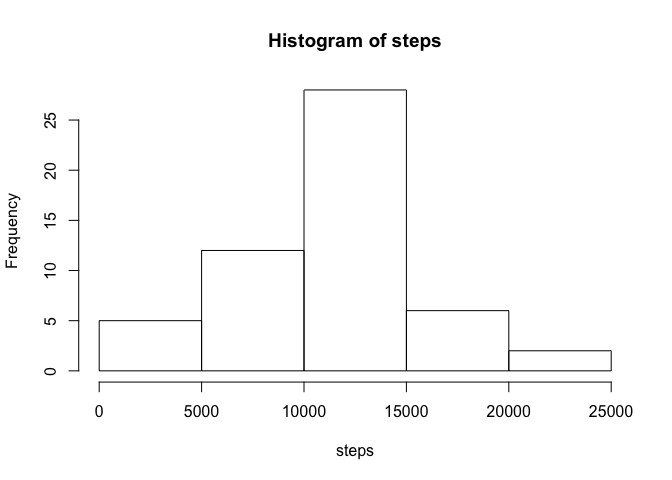

# Reproducible Research: Peer Assessment 1


## Loading and preprocessing the data

```r
setwd("/Users/dust/Courses/Coursera/RepData/RepData_PeerAssessment1")
unzip("activity.zip")
act <- read.csv("activity.csv")
```


## What is mean total number of steps taken per day?

```r
act2 <- act[which(!is.na(act$steps)),]
library(dplyr)
```

```
## 
## Attaching package: 'dplyr'
## 
## The following objects are masked from 'package:stats':
## 
##     filter, lag
## 
## The following objects are masked from 'package:base':
## 
##     intersect, setdiff, setequal, union
```

```r
steps_per_day <- act2 %>% tbl_df %>% group_by(date) %>% summarize(s=sum(steps))
steps <- steps_per_day$s
hist(steps)
```

 

```r
mean(steps)
```

```
## [1] 10766.19
```

```r
median(steps)
```

```
## [1] 10765
```


## What is the average daily activity pattern?

```r
steps_per_interval <- act2 %>% tbl_df %>% group_by(interval) %>% summarize(s=mean(steps))
plot(steps_per_interval$s, type="l")
```

 

```r
steps_per_interval[which(steps_per_interval$s == max(steps_per_interval$s)),]$interval
```

```
## [1] 835
```


## Imputing missing values

```r
act_na <- act[which(is.na(act$steps)),]
dim(act_na)
```

```
## [1] 2304    3
```

```r
act_impute <- merge(act_na, steps_per_interval, by="interval")
act3 <- act_impute %>% tbl_df %>% mutate(steps=s)
act4 <- rbind(act2,act3[,c("steps","date","interval")])
steps_per_day4 <- act4 %>% tbl_df %>% group_by(date) %>% summarize(s=sum(steps))
steps <- steps_per_day4$s
hist(steps)
```

 

```r
mean(steps)
```

```
## [1] 10766.19
```

```r
median(steps)
```

```
## [1] 10766.19
```


## Are there differences in activity patterns between weekdays and weekends?

```r
library(ggplot2)
weekend <- c("Saturday", "Sunday")
act5 <- act4 %>% tbl_df %>% mutate(day=factor((weekdays(as.Date(date)) %in% weekend), 
         levels=c(FALSE, TRUE), labels=c('weekday', 'weekend')))
act6 <- act5 %>% group_by(interval, day) %>% summarize(s=mean(steps))
qplot(interval, s, data=act6, facets = day~., geom= "line")
```

 

